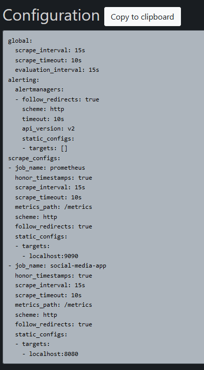
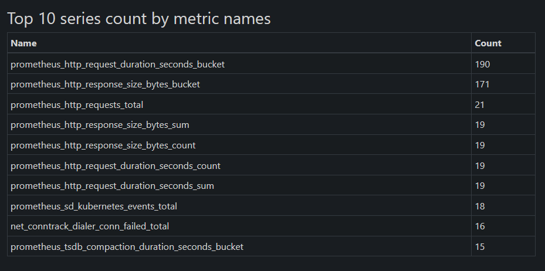
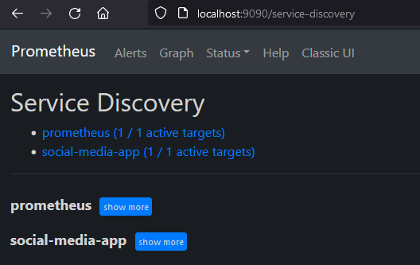
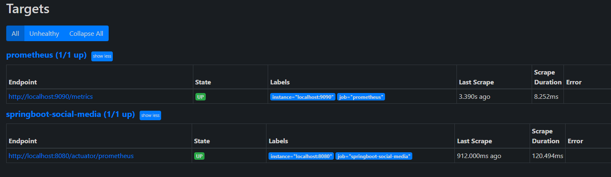
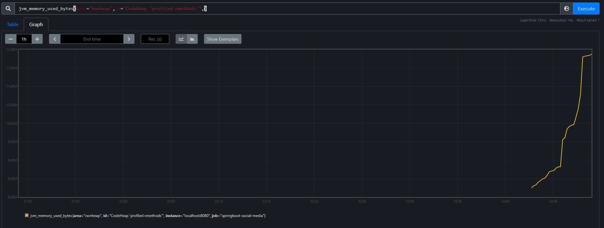

# Monitoring with Prometheus

## Run it on docker

Clone project:

    git clone https://github.com/Zeljko-Predjeskovic/springboot-social-media.git

Open cmd for the project:

    cd springboot-social-media

Maven install for the target/*.jar file

    mvn install

Build container with app and database

    docker-compose up

## Prometheus configuration yml

## Maven Dependencies

            <dependency>
			<groupId>org.springframework.boot</groupId>
			<artifactId>spring-boot-starter-actuator</artifactId>
			<version>2.6.2</version>
		</dependency>
		<dependency>
			<groupId>io.micrometer</groupId>
			<artifactId>micrometer-registry-prometheus</artifactId>
			<version>1.8.2</version>
		</dependency>

## Application.properties

    management.endpoint.prometheus.enabled=true
    
    management.endpoints.web.exposure.include=*
    
    management.metrics.export.prometheus.enabled=true

## Configuration

## Prometheus Status and Service Discovery

## Grafana

