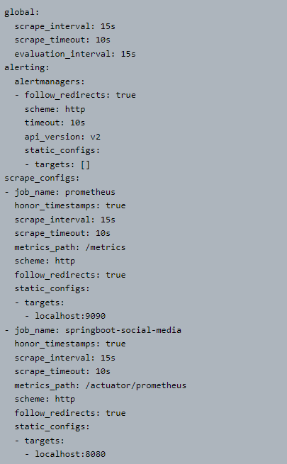

# Monitoring with Prometheus

## Run it on docker

Clone project:

    git clone https://github.com/Zeljko-Predjeskovic/springboot-social-media.git

Open cmd for the project:

    cd springboot-social-media

Maven install for the target/*.jar file

    mvn install

Build container with app and database

    docker-compose up

## Prometheus configuration yml

## Prometheus Status and Service Discovery

## Make an Insertion Post request

